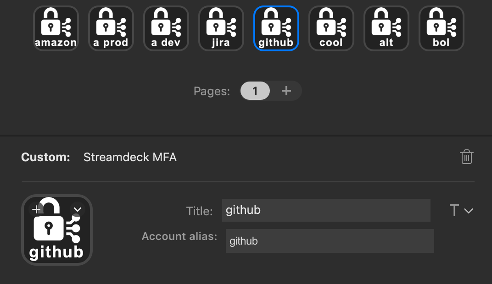

# Catfinger

Catfinger <a href="https://github.com/pisch/catfinger">https://github.com/pisch/catfinger</a> is a plugin for the Elgato Stream Deck connected to a mac.  It works with your OATH-TOTP-supporting YubiKey to make getting and entering an MFA code as simple as the push of a button — and a touch of the YubiKey.

## What it does

Catfinger operates similar to the Yubico Authenticator app (<a href="https://apps.apple.com/nl/app/yubico-authenticator/id1497506650?mt=12">app store link</a>), but instead of this usual interaction:

* Activate the Yubico Authenticator app
* Find and click the account
* Touch the key
* Copy the MFA code to the clipboard
* Dismiss the panel
* Go to the app where you need the MFA code
* Paste the MFA code
* Press Return

With Catfinger you do:

* Push the button on your Stream Deck that corresponds to the account
* Touch the key

Catfinger enters the MFA code and presses Return.

## How to use it

To add a Catfinger button to your Stream Deck, drag it from the available plugins onto the board and enter the account alias and the title of the button.  You can have multiple Catfinger buttons on your Stream Deck, one for each account stored on your YubiKey.



**TODO update screenshot**

To enter an MFA code in, e.g., safari, follow these two steps:

1. Push the Catfinger button of the account.  The button turns yellow to prompt you to touch the YubiKey.  The YubiKey itself will be flashing.
2. Touch the YubiKey.  The MFA code will be entered into Safari, followed by the Return key.  The button will turn green shortly before becoming white again.

If something is wrong, for example if the account is not known on the YubiKey or of a YubiKey is not plugged in, the button will turn red for a few seconds.

## Installation

In the Release folder, you can find the file `nl.impeto.catfingerPlugin`. If you double-click this file on your machine, Stream Deck will install the plugin.

### Prerequisites

* Catfinger uses the <a href="https://developers.yubico.com/yubikey-manager/">YubiKey Manager CLI</a> `ykman` to work with the yubikey.  Use Homebrew to install it:

```shell
brew install ykman
```

* Catfinger uses applescript to run an `ykman` command interacting with the YubiKey and to tell `System Events` to perform the key presses to enter the MFA code.

## YubiKey account management

Catfinger uses `ykman` to interact with the YubiKey.  Relevant `ykman` commands are:

* `ykman oath accounts add -t <account> <secret>` to create an account named \<account> with the given \<secret>.  Once stored, the \<account> is shown in the output of `ykman oath accounts list` and codes can be retrieved by `ykman oath accounts code <account>`.

* `ykman oath accounts list` to list the accounts stored on the YubiKey.

* `ykman oath accounts code <account>` to retrieve a code for the account named \<account>.

## TODO

 * Screenshot and document privacy and security settings.
 * Support multiple YubiKeys — A YubiKey 5NFC can store 32 accounts.  If you need more than 32 to be available at the same time and you don't want to swap YubiKeys, Catfinger needs to identify the YubiKey in the account preferences.
 * Configure a new account in the YubiKey straight from the plugin.
 * Handle a password-protected YubiKey OATH application.

# Source code

The Sources folder contains the source code of the plugin.

# Attribution

Catfinger builds on the work of giants:

 - <a href="https://github.com/elgatosf/streamdeck-applemail">AppleMail sample plugin</a> using Objective-C and AppleScript.
 - Property inspector from the <a href="https://github.com/elgatosf/streamdeck-plugin-template">Stream Deck Plugin Template</a> using JavaScript plugin preferences.
 - Original icon from <a href="https://www.flaticon.com/free-icons/security" title="security icons">Security icons created by Freepik - Flaticon</a>

# Information

catfinger@impeto.nl